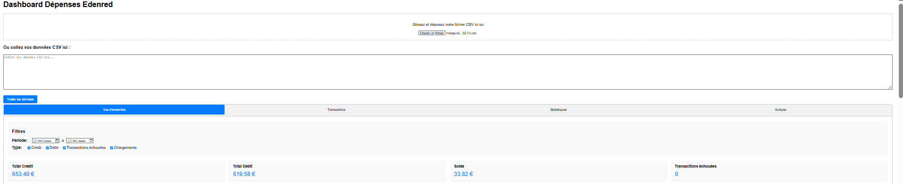

exemple de stats 

1. Vos fichiers exportés ne doit pas contenir de doublons ou un même paiement sur le même jour 
1. CLIQUez 

1. run thml page with the exported csv 
1. use [merge-csv](https://merge-csv.com/) and excel/bash/python-scripts in order to join/dedup columns
1. see insights and enjoy 

plus tard la doc ...